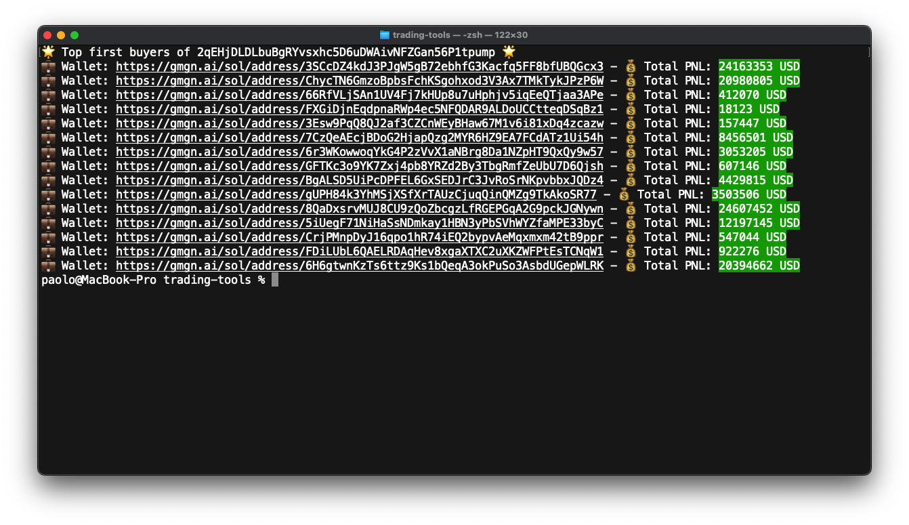

# First Buyers Lookup



<div align="center">
  A TypeScript-based utility for analyzing token buyers on the Solana blockchain using the SolanaTracker API.
</div>
<br>

## Features

- 🔍 Fetch first 100 buyers of any Solana token
- 📊 Filter buyers by PNL (Profit and Loss)
- 🎨 Console-based visualization with colored output for profits/losses
- 🔗 Direct links to wallet analysis on gmgn.ai

## Prerequisites

- 🖥️ Node.js (Latest LTS version recommended)
- 📦 pnpm package manager
- 🔑 SolanaTracker API key

## Installation

1. 📥 Clone the repository
2. ⚙️ Install dependencies:

```bash
pnpm install
```

## Configuration

Copy the `.env.example` file to `.env` and set your SolanaTracker API key. You can get an API key from [SolanaTracker](https://data.solanatracker.io).

## Usage

Run the application with a token address:

```bash
pnpm start <token-address>
```
